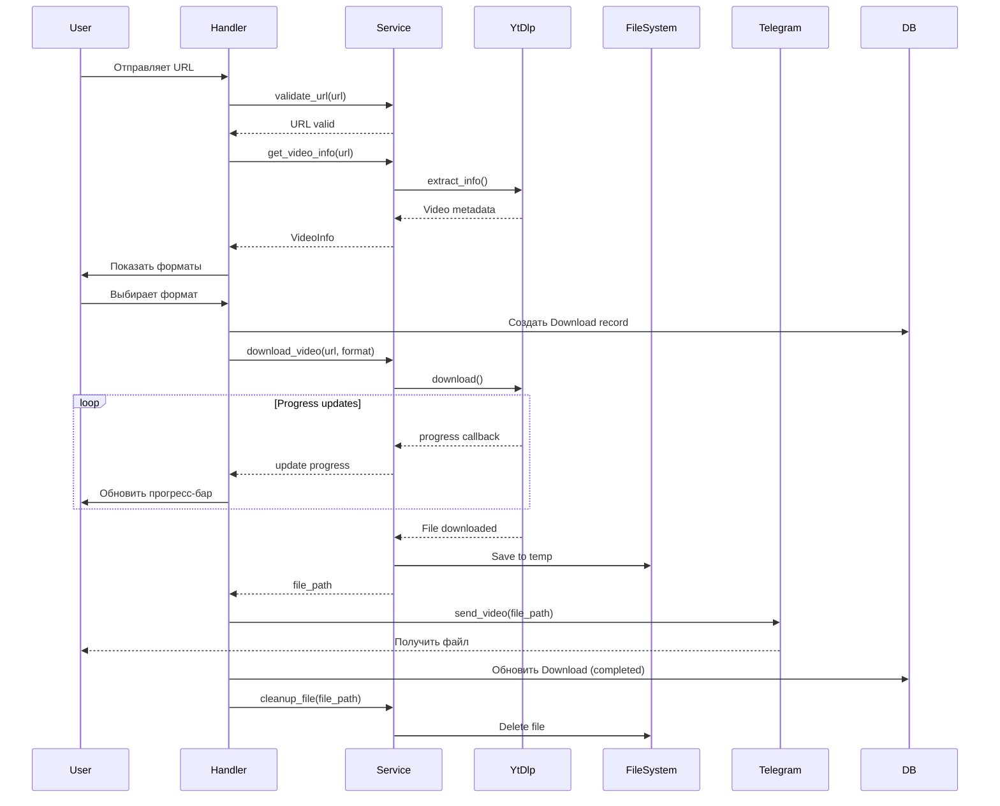

# Архитектура проекта

## 📁 Структура директорий

```
sly-fox-tunes/
├── bot/                           # Основной код бота
│   ├── __init__.py
│   ├── handlers/                  # Обработчики команд и сообщений
│   │   ├── __init__.py
│   │   ├── start.py              # /start, /help
│   │   ├── download.py           # Обработка ссылок и скачивание
│   │   ├── search.py             # Поиск по YouTube
│   │   ├── settings.py           # Настройки пользователя
│   │   ├── stats.py              # Статистика
│   │   └── common.py             # Общие обработчики (cancel, unknown)
│   ├── keyboards/                # Клавиатуры для бота
│   │   ├── __init__.py
│   │   ├── inline.py             # Inline клавиатуры
│   │   ├── reply.py              # Reply клавиатуры
│   │   └── builders.py           # Builder'ы для динамических клавиатур
│   ├── states/                   # FSM состояния
│   │   ├── __init__.py
│   │   ├── download.py           # Состояния для процесса скачивания
│   │   └── search.py             # Состояния для поиска
│   ├── middlewares/              # Middleware
│   │   ├── __init__.py
│   │   ├── logging.py            # Логирование запросов
│   │   ├── rate_limit.py         # Rate limiting
│   │   ├── database.py           # Инъекция сессии БД
│   │   └── user_context.py       # Контекст пользователя
│   └── filters/                  # Кастомные фильтры
│       ├── __init__.py
│       ├── url.py                # Фильтр для YouTube URL
│       └── admin.py              # Фильтр для админов
├── services/                     # Бизнес-логика
│   ├── __init__.py
│   ├── downloader.py            # Сервис скачивания (yt-dlp)
│   ├── file_manager.py          # Управление файлами
│   ├── youtube_search.py        # Поиск видео
│   ├── progress_tracker.py      # Отслеживание прогресса
│   ├── url_validator.py         # Валидация URL
│   └── format_converter.py      # Конвертация форматов (опционально)
├── database/                     # Работа с БД
│   ├── __init__.py
│   ├── models.py                # SQLAlchemy модели
│   ├── repositories/            # Репозитории для доступа к данным
│   │   ├── __init__.py
│   │   ├── base.py              # Базовый репозиторий
│   │   ├── user.py              # Репозиторий пользователей
│   │   └── download.py          # Репозиторий загрузок
│   ├── session.py               # Управление сессиями БД
│   └── migrations/              # Alembic миграции
│       ├── versions/
│       ├── env.py
│       └── script.py.mako
├── config/                       # Конфигурация
│   ├── __init__.py
│   ├── settings.py              # Настройки приложения
│   └── constants.py             # Константы
├── locales/                      # Интернационализация
│   ├── en/
│   │   └── LC_MESSAGES/
│   │       └── bot.po
│   └── ru/
│       └── LC_MESSAGES/
│           └── bot.po
├── utils/                        # Вспомогательные утилиты
│   ├── __init__.py
│   ├── formatters.py            # Форматирование текста
│   ├── validators.py            # Дополнительные валидаторы
│   ├── decorators.py            # Декораторы
│   └── helpers.py               # Вспомогательные функции
├── tests/                        # Тесты
│   ├── __init__.py
│   ├── conftest.py              # Pytest fixtures
│   ├── unit/                    # Unit тесты
│   │   ├── test_downloader.py
│   │   ├── test_file_manager.py
│   │   └── test_validators.py
│   ├── integration/             # Интеграционные тесты
│   │   ├── test_handlers.py
│   │   └── test_database.py
│   └── fixtures/                # Тестовые данные
│       └── sample_data.py
├── logs/                         # Логи (gitignore)
│   └── .gitkeep
├── temp/                         # Временные файлы (gitignore)
│   └── .gitkeep
├── docs/                         # Документация
│   ├── 01-CONCEPT.md
│   ├── 02-TECH-STACK.md
│   ├── 03-ARCHITECTURE.md
│   ├── 04-BUSINESS-PROCESSES.md
│   ├── 05-DATABASE-SCHEMA.md
│   ├── 06-DEVELOPMENT-PLAN.md
│   ├── 07-API-REFERENCE.md
│   └── diagrams/
│       ├── architecture.mmd
│       ├── user-flow.mmd
│       └── database-er.mmd
├── scripts/                      # Вспомогательные скрипты
│   ├── init_db.py               # Инициализация БД
│   ├── cleanup.py               # Очистка старых файлов
│   └── seed_data.py             # Заполнение тестовыми данными
├── .env.example                  # Пример переменных окружения
├── .gitignore
├── .dockerignore
├── Dockerfile                    # Docker образ
├── docker-compose.yml            # Docker Compose конфигурация
├── docker-compose.prod.yml       # Production конфигурация
├── requirements.txt              # Зависимости (управляются через uv)
├── requirements-dev.txt          # Dev зависимости (управляются через uv)
├── pyproject.toml               # Конфигурация проекта (black, isort, etc)
├── pytest.ini                   # Pytest конфигурация
├── alembic.ini                  # Alembic конфигурация
├── README.md                    # Основное README
├── LICENSE                      # Лицензия
└── main.py                      # Точка входа приложения
```

## 🏗️ Архитектурные паттерны

### 1. **Layered Architecture (Слоистая архитектура)**

```
┌─────────────────────────────────────────┐
│         Presentation Layer              │
│      (Handlers, Keyboards, FSM)         │
├─────────────────────────────────────────┤
│         Business Logic Layer            │
│    (Services: Downloader, FileManager)  │
├─────────────────────────────────────────┤
│         Data Access Layer               │
│      (Repositories, Models, ORM)        │
├─────────────────────────────────────────┤
│         Infrastructure Layer            │
│    (Database, Redis, File System)       │
└─────────────────────────────────────────┘
```

**Преимущества:**
- Разделение ответственности
- Тестируемость каждого слоя
- Легкость замены компонентов
- Понятная структура

### 2. **Repository Pattern**

Абстракция доступа к данным через репозитории:

```python
# Пример использования
user_repo = UserRepository(session)
user = await user_repo.get_by_telegram_id(telegram_id)
await user_repo.update_settings(user, settings)
```

**Преимущества:**
- Изоляция бизнес-логики от БД
- Упрощение тестирования (легко мокать)
- Централизация query логики

### 3. **Service Layer Pattern**

Бизнес-логика инкапсулирована в сервисы:

```python
# Пример
downloader_service = DownloaderService()
video_info = await downloader_service.get_video_info(url)
file_path = await downloader_service.download_video(url, quality)
```

**Преимущества:**
- Переиспользование логики
- Независимость от UI/API
- Простота тестирования

### 4. **Dependency Injection**

Зависимости передаются через middleware или параметры:

```python
@router.message(Command("start"))
async def start_handler(
    message: Message,
    user_repo: UserRepository,  # Инъекция через middleware
    state: FSMContext
):
    ...
```

## 🔄 Поток данных

### Основной flow скачивания



## 🔌 Компоненты системы

### 1. **Bot (aiogram)**
- **Роль:** Точка входа, обработка сообщений
- **Ответственность:** Routing, валидация ввода, формирование ответов
- **Взаимодействие:** Services, Database (через repos)

### 2. **Downloader Service**
- **Роль:** Скачивание медиа
- **Ответственность:** Взаимодействие с yt-dlp, прогресс-трекинг
- **Технологии:** yt-dlp, asyncio
- **API:**
  ```python
  async def get_video_info(url: str) -> VideoInfo
  async def download_video(url: str, quality: str, progress_cb) -> Path
  async def download_audio(url: str, progress_cb) -> Path
  async def search_videos(query: str, max_results: int) -> List[VideoInfo]
  ```

### 3. **File Manager Service**
- **Роль:** Управление временными файлами
- **Ответственность:** Создание, хранение, удаление файлов
- **API:**
  ```python
  async def create_temp_dir(user_id: int) -> Path
  async def cleanup_file(file_path: Path) -> None
  async def cleanup_old_files(max_age_hours: int) -> int
  def get_user_temp_dir(user_id: int) -> Path
  ```

### 4. **Database Layer**
- **Роль:** Персистентность данных
- **Компоненты:**
  - Models (SQLAlchemy)
  - Repositories (Data Access)
  - Session Management
  - Migrations (Alembic)

### 5. **Cache Layer (Redis)**
- **Роль:** Временное хранилище
- **Использование:**
  - Rate limiting данные
  - Кэш метаданных видео
  - Очереди задач
  - FSM состояния (опционально)

## 🔐 Безопасность

### Принципы
1. **Валидация входных данных** - все URL и текст проверяются
2. **Rate Limiting** - защита от флуда
3. **Санитизация** - очистка путей файлов от инъекций
4. **Логирование** - аудит всех действий
5. **Секреты** - env variables, никогда в коде

### Реализация

```python
# Rate Limiting
@rate_limit(max_requests=5, window_seconds=60)
async def download_handler(message: Message):
    ...

# URL Validation
def validate_youtube_url(url: str) -> bool:
    allowed_domains = ['youtube.com', 'youtu.be', 'm.youtube.com']
    return any(domain in url for domain in allowed_domains)

# Path Sanitization
def safe_filename(filename: str) -> str:
    return re.sub(r'[^\w\s-]', '', filename)[:200]
```

## 📊 Масштабирование

### Вертикальное (Scale Up)
- Увеличение ресурсов сервера (CPU, RAM, SSD)
- Подходит для начального этапа

### Горизонтальное (Scale Out)
- **Multiple bot instances** - несколько инстансов бота
- **Load Balancer** - распределение нагрузки
- **Shared State** - Redis для FSM и кэша
- **Database Replication** - master-slave PostgreSQL
- **Queue System** - Celery для асинхронных задач

### Архитектура для высоких нагрузок

```
                    ┌─────────────┐
                    │  Load       │
                    │  Balancer   │
                    └──────┬──────┘
                           │
        ┌──────────────────┼──────────────────┐
        │                  │                  │
   ┌────▼────┐       ┌────▼────┐       ┌────▼────┐
   │  Bot    │       │  Bot    │       │  Bot    │
   │Instance1│       │Instance2│       │Instance3│
   └────┬────┘       └────┬────┘       └────┬────┘
        │                  │                  │
        └──────────────────┼──────────────────┘
                           │
                ┌──────────┴──────────┐
                │                     │
          ┌─────▼─────┐        ┌─────▼─────┐
          │   Redis   │        │PostgreSQL │
          │  (Cache)  │        │ (Master)  │
          └───────────┘        └─────┬─────┘
                                     │
                              ┌──────┴──────┐
                         ┌────▼────┐  ┌────▼────┐
                         │PostgreSQL│  │PostgreSQL│
                         │ (Slave1) │  │ (Slave2) │
                         └──────────┘  └──────────┘
```

## 🧪 Тестируемость

### Принципы
1. **Dependency Injection** - легко подменять зависимости
2. **Interface Segregation** - маленькие, фокусированные интерфейсы
3. **Mocking** - моки для внешних сервисов (yt-dlp, Telegram API)
4. **Test Fixtures** - переиспользуемые тестовые данные

### Пример тестируемого кода

```python
# Плохо (тяжело тестировать)
async def download_handler(message: Message):
    downloader = DownloaderService()  # Жёсткая зависимость
    result = await downloader.download(message.text)
    await message.answer(result)

# Хорошо (легко тестировать)
async def download_handler(
    message: Message,
    downloader: DownloaderService  # Инъекция зависимости
):
    result = await downloader.download(message.text)
    await message.answer(result)

# В тесте
async def test_download_handler():
    mock_downloader = Mock(DownloaderService)
    mock_downloader.download.return_value = "success"
    
    await download_handler(fake_message, mock_downloader)
    
    mock_downloader.download.assert_called_once()
```

## 🔄 CI/CD Pipeline

```
┌────────────┐    ┌─────────────┐    ┌──────────┐    ┌──────────┐
│   Commit   │───▶│   Lint &    │───▶│   Test   │───▶│  Build   │
│  to main   │    │   Format    │    │   Suite  │    │  Docker  │
└────────────┘    └─────────────┘    └──────────┘    └──────────┘
                                                             │
                                                             ▼
                                                      ┌──────────┐
                                                      │  Deploy  │
                                                      │    to    │
                                                      │  Server  │
                                                      └──────────┘
```

**Этапы:**
1. **Lint**: ruff, black, isort
2. **Type Check**: mypy
3. **Tests**: pytest (unit + integration)
4. **Build**: Docker image
5. **Deploy**: SSH to server or Kubernetes

---

**Дата создания:** 3 ноября 2025 г.  
**Версия:** 1.0  
**Статус:** Базовая архитектура для разработки
