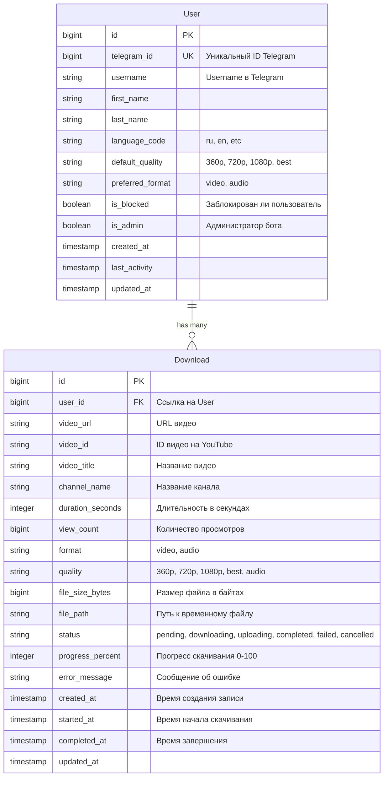

# Схема базы данных

## 📊 ER-диаграмма



## 📋 Детальное описание таблиц

### Таблица: users

**Назначение:** Хранение информации о пользователях бота

| Колонка | Тип | Ограничения | Описание |
|---------|-----|-------------|----------|
| `id` | BIGSERIAL | PRIMARY KEY | Внутренний ID |
| `telegram_id` | BIGINT | NOT NULL, UNIQUE | ID пользователя в Telegram |
| `username` | VARCHAR(255) | NULLABLE | Username (@username) |
| `first_name` | VARCHAR(255) | NOT NULL | Имя |
| `last_name` | VARCHAR(255) | NULLABLE | Фамилия |
| `language_code` | VARCHAR(10) | DEFAULT 'ru' | Код языка (ISO 639-1) |
| `default_quality` | VARCHAR(20) | DEFAULT '720p' | Качество по умолчанию |
| `preferred_format` | VARCHAR(20) | DEFAULT 'video' | Предпочитаемый формат |
| `is_blocked` | BOOLEAN | DEFAULT FALSE | Заблокирован ли пользователь |
| `is_admin` | BOOLEAN | DEFAULT FALSE | Является ли администратором |
| `created_at` | TIMESTAMP | DEFAULT NOW() | Дата регистрации |
| `last_activity` | TIMESTAMP | DEFAULT NOW() | Последняя активность |
| `updated_at` | TIMESTAMP | DEFAULT NOW() | Последнее обновление |

**Индексы:**
```sql
CREATE INDEX idx_users_telegram_id ON users(telegram_id);
CREATE INDEX idx_users_username ON users(username);
CREATE INDEX idx_users_last_activity ON users(last_activity);
```

**Значения по умолчанию:**
- `default_quality`: '360p', '720p', '1080p', 'best'
- `preferred_format`: 'video', 'audio'
- `language_code`: 'ru', 'en'

---

### Таблица: downloads

**Назначение:** История всех скачиваний пользователей

| Колонка | Тип | Ограничения | Описание |
|---------|-----|-------------|----------|
| `id` | BIGSERIAL | PRIMARY KEY | Уникальный ID скачивания |
| `user_id` | BIGINT | FOREIGN KEY → users(id), NOT NULL | Ссылка на пользователя |
| `video_url` | TEXT | NOT NULL | Полный URL видео |
| `video_id` | VARCHAR(50) | NOT NULL | ID видео (из URL) |
| `video_title` | TEXT | NOT NULL | Название видео |
| `channel_name` | VARCHAR(255) | NULLABLE | Название канала |
| `duration_seconds` | INTEGER | NULLABLE | Длительность в секундах |
| `view_count` | BIGINT | NULLABLE | Количество просмотров |
| `format` | VARCHAR(20) | NOT NULL | Формат (video/audio) |
| `quality` | VARCHAR(20) | NOT NULL | Качество |
| `file_size_bytes` | BIGINT | NULLABLE | Размер файла |
| `file_path` | TEXT | NULLABLE | Путь к временному файлу |
| `status` | VARCHAR(20) | NOT NULL, DEFAULT 'pending' | Статус скачивания |
| `progress_percent` | INTEGER | DEFAULT 0, CHECK (0 <= progress_percent <= 100) | Прогресс |
| `error_message` | TEXT | NULLABLE | Сообщение об ошибке |
| `created_at` | TIMESTAMP | DEFAULT NOW() | Время создания |
| `started_at` | TIMESTAMP | NULLABLE | Время начала скачивания |
| `completed_at` | TIMESTAMP | NULLABLE | Время завершения |
| `updated_at` | TIMESTAMP | DEFAULT NOW() | Последнее обновление |

**Индексы:**
```sql
CREATE INDEX idx_downloads_user_id ON downloads(user_id);
CREATE INDEX idx_downloads_video_id ON downloads(video_id);
CREATE INDEX idx_downloads_status ON downloads(status);
CREATE INDEX idx_downloads_created_at ON downloads(created_at DESC);
CREATE INDEX idx_downloads_user_created ON downloads(user_id, created_at DESC);
```

**Статусы:**
- `pending` - В очереди
- `downloading` - Скачивается
- `uploading` - Загружается в Telegram
- `completed` - Успешно завершено
- `failed` - Ошибка
- `cancelled` - Отменено пользователем

**Форматы:**
- `video` - Видео файл
- `audio` - Аудио файл (MP3)

**Качество:**
- `360p`, `720p`, `1080p`, `best` - для видео
- `audio` - для аудио

---

### Таблица: user_statistics (представление - VIEW)

**Назначение:** Агрегированная статистика по пользователям

Это материализованное представление (или обычный VIEW), которое вычисляется на лету:

```sql
CREATE VIEW user_statistics AS
SELECT 
    u.id as user_id,
    u.telegram_id,
    u.username,
    COUNT(d.id) as total_downloads,
    COUNT(CASE WHEN d.format = 'video' THEN 1 END) as video_downloads,
    COUNT(CASE WHEN d.format = 'audio' THEN 1 END) as audio_downloads,
    SUM(CASE WHEN d.status = 'completed' THEN d.file_size_bytes ELSE 0 END) as total_bytes,
    AVG(CASE 
        WHEN d.status = 'completed' 
        THEN EXTRACT(EPOCH FROM (d.completed_at - d.started_at)) 
        ELSE NULL 
    END) as avg_download_time_seconds,
    MAX(d.created_at) as last_download_at,
    MIN(d.created_at) as first_download_at
FROM users u
LEFT JOIN downloads d ON u.id = d.user_id
GROUP BY u.id, u.telegram_id, u.username;
```

---

## 🔑 Связи между таблицами

```
users (1) ←→ (N) downloads
```

- Один пользователь может иметь много скачиваний
- Каждое скачивание принадлежит одному пользователю
- При удалении пользователя скачивания также удаляются (CASCADE)

```sql
ALTER TABLE downloads
ADD CONSTRAINT fk_downloads_user
FOREIGN KEY (user_id) 
REFERENCES users(id) 
ON DELETE CASCADE
ON UPDATE CASCADE;
```

---

## 📝 SQL-скрипты создания таблиц

### 1. Создание таблицы users

```sql
CREATE TABLE users (
    id BIGSERIAL PRIMARY KEY,
    telegram_id BIGINT NOT NULL UNIQUE,
    username VARCHAR(255),
    first_name VARCHAR(255) NOT NULL,
    last_name VARCHAR(255),
    language_code VARCHAR(10) DEFAULT 'ru',
    default_quality VARCHAR(20) DEFAULT '720p' 
        CHECK (default_quality IN ('360p', '720p', '1080p', 'best')),
    preferred_format VARCHAR(20) DEFAULT 'video' 
        CHECK (preferred_format IN ('video', 'audio')),
    is_blocked BOOLEAN DEFAULT FALSE,
    is_admin BOOLEAN DEFAULT FALSE,
    created_at TIMESTAMP DEFAULT CURRENT_TIMESTAMP,
    last_activity TIMESTAMP DEFAULT CURRENT_TIMESTAMP,
    updated_at TIMESTAMP DEFAULT CURRENT_TIMESTAMP
);

-- Индексы
CREATE INDEX idx_users_telegram_id ON users(telegram_id);
CREATE INDEX idx_users_username ON users(username);
CREATE INDEX idx_users_last_activity ON users(last_activity);

-- Триггер для автоматического обновления updated_at
CREATE OR REPLACE FUNCTION update_updated_at_column()
RETURNS TRIGGER AS $$
BEGIN
    NEW.updated_at = CURRENT_TIMESTAMP;
    RETURN NEW;
END;
$$ language 'plpgsql';

CREATE TRIGGER update_users_updated_at 
    BEFORE UPDATE ON users
    FOR EACH ROW
    EXECUTE FUNCTION update_updated_at_column();
```

### 2. Создание таблицы downloads

```sql
CREATE TABLE downloads (
    id BIGSERIAL PRIMARY KEY,
    user_id BIGINT NOT NULL REFERENCES users(id) ON DELETE CASCADE,
    video_url TEXT NOT NULL,
    video_id VARCHAR(50) NOT NULL,
    video_title TEXT NOT NULL,
    channel_name VARCHAR(255),
    duration_seconds INTEGER CHECK (duration_seconds > 0),
    view_count BIGINT CHECK (view_count >= 0),
    format VARCHAR(20) NOT NULL CHECK (format IN ('video', 'audio')),
    quality VARCHAR(20) NOT NULL,
    file_size_bytes BIGINT CHECK (file_size_bytes > 0),
    file_path TEXT,
    status VARCHAR(20) NOT NULL DEFAULT 'pending' 
        CHECK (status IN ('pending', 'downloading', 'uploading', 'completed', 'failed', 'cancelled')),
    progress_percent INTEGER DEFAULT 0 CHECK (progress_percent >= 0 AND progress_percent <= 100),
    error_message TEXT,
    created_at TIMESTAMP DEFAULT CURRENT_TIMESTAMP,
    started_at TIMESTAMP,
    completed_at TIMESTAMP,
    updated_at TIMESTAMP DEFAULT CURRENT_TIMESTAMP
);

-- Индексы
CREATE INDEX idx_downloads_user_id ON downloads(user_id);
CREATE INDEX idx_downloads_video_id ON downloads(video_id);
CREATE INDEX idx_downloads_status ON downloads(status);
CREATE INDEX idx_downloads_created_at ON downloads(created_at DESC);
CREATE INDEX idx_downloads_user_created ON downloads(user_id, created_at DESC);

-- Триггер для обновления updated_at
CREATE TRIGGER update_downloads_updated_at 
    BEFORE UPDATE ON downloads
    FOR EACH ROW
    EXECUTE FUNCTION update_updated_at_column();
```

### 3. Создание VIEW для статистики

```sql
CREATE OR REPLACE VIEW user_statistics AS
SELECT 
    u.id as user_id,
    u.telegram_id,
    u.username,
    u.first_name,
    u.created_at as registered_at,
    COUNT(d.id) as total_downloads,
    COUNT(CASE WHEN d.format = 'video' THEN 1 END) as video_downloads,
    COUNT(CASE WHEN d.format = 'audio' THEN 1 END) as audio_downloads,
    COUNT(CASE WHEN d.status = 'completed' THEN 1 END) as successful_downloads,
    COUNT(CASE WHEN d.status = 'failed' THEN 1 END) as failed_downloads,
    COALESCE(SUM(CASE WHEN d.status = 'completed' THEN d.file_size_bytes ELSE 0 END), 0) as total_bytes_downloaded,
    COALESCE(AVG(CASE 
        WHEN d.status = 'completed' AND d.started_at IS NOT NULL AND d.completed_at IS NOT NULL
        THEN EXTRACT(EPOCH FROM (d.completed_at - d.started_at)) 
        ELSE NULL 
    END), 0) as avg_download_time_seconds,
    MAX(d.created_at) as last_download_at,
    MIN(d.created_at) as first_download_at
FROM users u
LEFT JOIN downloads d ON u.id = d.user_id
GROUP BY u.id, u.telegram_id, u.username, u.first_name, u.created_at;
```

---

## 🔍 Полезные запросы

### Получить статистику пользователя

```sql
SELECT * FROM user_statistics 
WHERE telegram_id = ?;
```

### Топ-5 последних скачиваний пользователя

```sql
SELECT video_title, format, quality, created_at, status
FROM downloads
WHERE user_id = (SELECT id FROM users WHERE telegram_id = ?)
ORDER BY created_at DESC
LIMIT 5;
```

### Популярные видео (самые скачиваемые)

```sql
SELECT video_title, video_id, COUNT(*) as download_count
FROM downloads
WHERE status = 'completed'
GROUP BY video_title, video_id
ORDER BY download_count DESC
LIMIT 10;
```

### Активные скачивания пользователя

```sql
SELECT id, video_title, progress_percent, status
FROM downloads
WHERE user_id = (SELECT id FROM users WHERE telegram_id = ?)
  AND status IN ('pending', 'downloading', 'uploading')
ORDER BY created_at DESC;
```

### Общая статистика бота

```sql
SELECT 
    COUNT(DISTINCT user_id) as total_users,
    COUNT(*) as total_downloads,
    SUM(CASE WHEN status = 'completed' THEN 1 ELSE 0 END) as successful_downloads,
    SUM(CASE WHEN status = 'failed' THEN 1 ELSE 0 END) as failed_downloads,
    SUM(CASE WHEN status = 'completed' THEN file_size_bytes ELSE 0 END) / (1024*1024*1024.0) as total_gb_downloaded,
    AVG(CASE 
        WHEN status = 'completed' AND started_at IS NOT NULL AND completed_at IS NOT NULL
        THEN EXTRACT(EPOCH FROM (completed_at - started_at)) 
    END) as avg_download_time_seconds
FROM downloads;
```

### Активные пользователи за последние 7 дней

```sql
SELECT COUNT(DISTINCT user_id) as active_users
FROM downloads
WHERE created_at >= NOW() - INTERVAL '7 days';
```

### Неудачные скачивания с группировкой по ошибкам

```sql
SELECT error_message, COUNT(*) as error_count
FROM downloads
WHERE status = 'failed' AND error_message IS NOT NULL
GROUP BY error_message
ORDER BY error_count DESC
LIMIT 10;
```

---

## 🗄️ Миграции (Alembic)

### Начальная миграция

```python
"""Initial migration

Revision ID: 001
Revises: 
Create Date: 2025-11-03
"""
from alembic import op
import sqlalchemy as sa

revision = '001'
down_revision = None
branch_labels = None
depends_on = None

def upgrade():
    # Создание таблицы users
    op.create_table(
        'users',
        sa.Column('id', sa.BigInteger(), nullable=False),
        sa.Column('telegram_id', sa.BigInteger(), nullable=False),
        sa.Column('username', sa.String(255), nullable=True),
        sa.Column('first_name', sa.String(255), nullable=False),
        sa.Column('last_name', sa.String(255), nullable=True),
        sa.Column('language_code', sa.String(10), nullable=True, default='ru'),
        sa.Column('default_quality', sa.String(20), nullable=True, default='720p'),
        sa.Column('preferred_format', sa.String(20), nullable=True, default='video'),
        sa.Column('is_blocked', sa.Boolean(), nullable=False, default=False),
        sa.Column('is_admin', sa.Boolean(), nullable=False, default=False),
        sa.Column('created_at', sa.TIMESTAMP(), nullable=False, server_default=sa.func.now()),
        sa.Column('last_activity', sa.TIMESTAMP(), nullable=False, server_default=sa.func.now()),
        sa.Column('updated_at', sa.TIMESTAMP(), nullable=False, server_default=sa.func.now()),
        sa.PrimaryKeyConstraint('id'),
        sa.UniqueConstraint('telegram_id')
    )
    
    # Создание индексов для users
    op.create_index('idx_users_telegram_id', 'users', ['telegram_id'])
    op.create_index('idx_users_username', 'users', ['username'])
    op.create_index('idx_users_last_activity', 'users', ['last_activity'])
    
    # Создание таблицы downloads
    op.create_table(
        'downloads',
        sa.Column('id', sa.BigInteger(), nullable=False),
        sa.Column('user_id', sa.BigInteger(), nullable=False),
        sa.Column('video_url', sa.Text(), nullable=False),
        sa.Column('video_id', sa.String(50), nullable=False),
        sa.Column('video_title', sa.Text(), nullable=False),
        sa.Column('channel_name', sa.String(255), nullable=True),
        sa.Column('duration_seconds', sa.Integer(), nullable=True),
        sa.Column('view_count', sa.BigInteger(), nullable=True),
        sa.Column('format', sa.String(20), nullable=False),
        sa.Column('quality', sa.String(20), nullable=False),
        sa.Column('file_size_bytes', sa.BigInteger(), nullable=True),
        sa.Column('file_path', sa.Text(), nullable=True),
        sa.Column('status', sa.String(20), nullable=False, default='pending'),
        sa.Column('progress_percent', sa.Integer(), nullable=False, default=0),
        sa.Column('error_message', sa.Text(), nullable=True),
        sa.Column('created_at', sa.TIMESTAMP(), nullable=False, server_default=sa.func.now()),
        sa.Column('started_at', sa.TIMESTAMP(), nullable=True),
        sa.Column('completed_at', sa.TIMESTAMP(), nullable=True),
        sa.Column('updated_at', sa.TIMESTAMP(), nullable=False, server_default=sa.func.now()),
        sa.ForeignKeyConstraint(['user_id'], ['users.id'], ondelete='CASCADE'),
        sa.PrimaryKeyConstraint('id')
    )
    
    # Создание индексов для downloads
    op.create_index('idx_downloads_user_id', 'downloads', ['user_id'])
    op.create_index('idx_downloads_video_id', 'downloads', ['video_id'])
    op.create_index('idx_downloads_status', 'downloads', ['status'])
    op.create_index('idx_downloads_created_at', 'downloads', ['created_at'])
    op.create_index('idx_downloads_user_created', 'downloads', ['user_id', 'created_at'])

def downgrade():
    op.drop_index('idx_downloads_user_created', table_name='downloads')
    op.drop_index('idx_downloads_created_at', table_name='downloads')
    op.drop_index('idx_downloads_status', table_name='downloads')
    op.drop_index('idx_downloads_video_id', table_name='downloads')
    op.drop_index('idx_downloads_user_id', table_name='downloads')
    op.drop_table('downloads')
    
    op.drop_index('idx_users_last_activity', table_name='users')
    op.drop_index('idx_users_username', table_name='users')
    op.drop_index('idx_users_telegram_id', table_name='users')
    op.drop_table('users')
```

---

## 💾 Объём данных и оптимизация

### Оценка размера БД

**Для 10,000 пользователей:**
- Users: ~10,000 записей × 500 bytes = ~5 MB
- Downloads (100 на пользователя): ~1,000,000 записей × 800 bytes = ~800 MB
- Индексы: ~200 MB
- **Итого:** ~1 GB

### Стратегия очистки старых данных

```sql
-- Удаление записей старше 6 месяцев
DELETE FROM downloads 
WHERE created_at < NOW() - INTERVAL '6 months' 
  AND status IN ('completed', 'failed', 'cancelled');

-- Или архивация
CREATE TABLE downloads_archive (LIKE downloads INCLUDING ALL);

INSERT INTO downloads_archive 
SELECT * FROM downloads 
WHERE created_at < NOW() - INTERVAL '6 months';

DELETE FROM downloads 
WHERE created_at < NOW() - INTERVAL '6 months';
```

---

**Дата создания:** 3 ноября 2025 г.  
**Версия:** 1.0  
**СУБД:** PostgreSQL 15+ (совместимо с SQLite для MVP)
